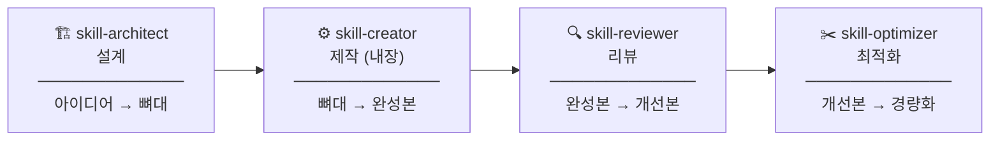

# 🏗️ Skill Pipeline for Claude Cowork

> Claude Cowork 스킬을 **설계 → 제작 → 리뷰 → 최적화** 까지 체계적으로 만들 수 있는 스킬 파이프라인

---

## 이게 뭔가요?

Claude Cowork에서 나만의 스킬을 만들고 싶은데 어디서 시작해야 할지 모르겠다면, 이 파이프라인이 그 길을 안내해줍니다.

아이디어 하나를 가지고 들어오면, 완성도 높은 스킬 하나가 나옵니다.

---

## 파이프라인 구조



각 단계는 독립적으로도 쓸 수 있어요. 이미 스킬이 있다면 reviewer나 optimizer부터 시작해도 됩니다.

---

## 스킬 소개

### 1. `skill-architect` — 설계
막연한 아이디어를 구체적인 스킬 설계도로 만들어줍니다.

- **브레인스토밍**: "뭔가 필요한데 뭔지 모르겠어요" 상태에서도 시작 가능
- **유형 분류**: 분석형 / 액션형 / 라우터형 / 생성형 / 복합형 중 최적 유형 추천
- **산출물**: `SKILL.md` 뼈대(skeleton) + `design_brief.md` 설계 문서
- **핸드오프**: skill-creator로 넘겨줄 준비까지 완료

```
"스킬 만들고 싶어" → 브레인스토밍 → 아이디어 확정 → 유형 분류 → 기술 스펙 → 설계 구조 → 뼈대 생성
```

---

### 2. `skill-creator` — 제작 *(Claude Cowork 내장 스킬)*

skill-architect가 만든 뼈대를 실제로 동작하는 스킬로 채웁니다.  
Claude Cowork에 기본 탑재된 스킬로, 별도 설치가 필요 없습니다.

- 각 Step의 세부 로직 작성
- 실제 도구 호출 방법 연결
- 예외 처리 및 테스트

---

### 3. `skill-reviewer` — 리뷰
완성된 `SKILL.md`를 **컨텍스트 관리** 관점에서 분석하고 개선본을 만들어줍니다.

- **10가지 컨텍스트 관리 패턴** 기준으로 체크리스트 분석
- 원본의 기능·로직은 건드리지 않고 구조만 개선
- **산출물**: 패턴별 리뷰 리포트 + `SKILL_improved.md`
- 원본 파일은 절대 덮어쓰지 않음

```
"이 스킬 리뷰해줘" → 패턴 분석 → [확인] → 리뷰 리포트 → 개선본 초안 → 기능 보존 검증 → [확인] → 저장
```

---

### 4. `skill-optimizer` — 최적화
스킬이 너무 무겁거나 컨텍스트 압축이 자주 일어난다면 여기서 다이어트시킵니다.

- 구조 분석 → 진단 리포트 → 승인 → 리팩터링
- 기능·동작·트리거 조건은 변경하지 않고 크기·구조·가독성만 개선
- **산출물**: `[스킬명]-optimized.md` + `[스킬명]-optimization-report.md`
- 원본은 읽기 전용, 모든 작업은 복사본에서

```
"스킬이 너무 무거워" → 구조 파악 → [확인] → 진단 리포트 → [승인] → 리팩터링 → [최종 승인] → 저장
```

---

## 설치 방법

### skill-architect / skill-reviewer / skill-optimizer

1. 이 저장소를 다운로드합니다
2. 각 스킬 폴더(`skill-architect/`, `skill-reviewer/`, `skill-optimizer/`)를  
   Claude Cowork의 플러그인 폴더에 복사합니다
3. Cowork를 재시작하면 스킬이 활성화됩니다

### skill-creator

Claude Cowork에 기본 탑재된 스킬입니다. 별도 설치가 필요 없습니다.

---

## 사용 예시

### 새 스킬 처음 만들 때
```
/skill-architect 시작
→ (설계 완료 후)
/skill-creator 로 이어서 진행
```

### 기존 스킬 품질 체크하고 싶을 때
```
SKILL.md 파일을 올리고 → "이 스킬 리뷰해줘"
```

### 스킬이 너무 무거울 때
```
SKILL.md 파일을 올리고 → "스킬 최적화해줘"
```

### 처음부터 끝까지 다 하고 싶을 때
```
skill-architect → skill-creator → skill-reviewer → skill-optimizer
```

---

## 각 스킬 트리거 키워드

| 스킬 | 이런 말을 하면 자동으로 실행돼요 |
|------|-------------------------------|
| skill-architect | "스킬 만들고 싶어", "스킬 설계해줘", "스킬 기획해줘", "어떤 스킬 만들면 좋을까" |
| skill-reviewer | "이 스킬 리뷰해줘", "스킬 점검해줘", "컨텍스트 관리 괜찮아?", "스킬 검토해줘" |
| skill-optimizer | "스킬 최적화해줘", "스킬이 너무 무거워", "컨텍스트 압축이 일어나", "SKILL.md 다이어트" |

---

## 요구 사항

- **Claude Cowork** (데스크톱 앱)
- skill-creator는 Cowork 내장 스킬이므로 별도 설치 불필요

---

## 각 스킬의 범위 (scope)

각 스킬은 맡은 영역만 담당합니다. 경계를 넘는 요청은 적절한 스킬로 안내해줍니다.

| | reviewer | optimizer |
|---|---|---|
| 컨텍스트 패턴 분석·개선 | ✅ | ❌ |
| 경량화·구조 다이어트 | ❌ | ✅ |
| 기능 추가·변경 | ❌ | ❌ |
| 원본 파일 덮어쓰기 | ❌ | ❌ |

---

## 만든 사람

**Blue (조남경)** — 미드저니 코리아, Claude Cowork 스킬 개발자  
- YouTube: [미드저니 코리아 조남경](https://www.youtube.com/@mjKorea123)
- Facebook: [미드저니 코리아](https://facebook.com/groups/midjourneykorea)

---

## 라이선스

MIT License — 자유롭게 사용하고, 개선하고, 공유하세요.
